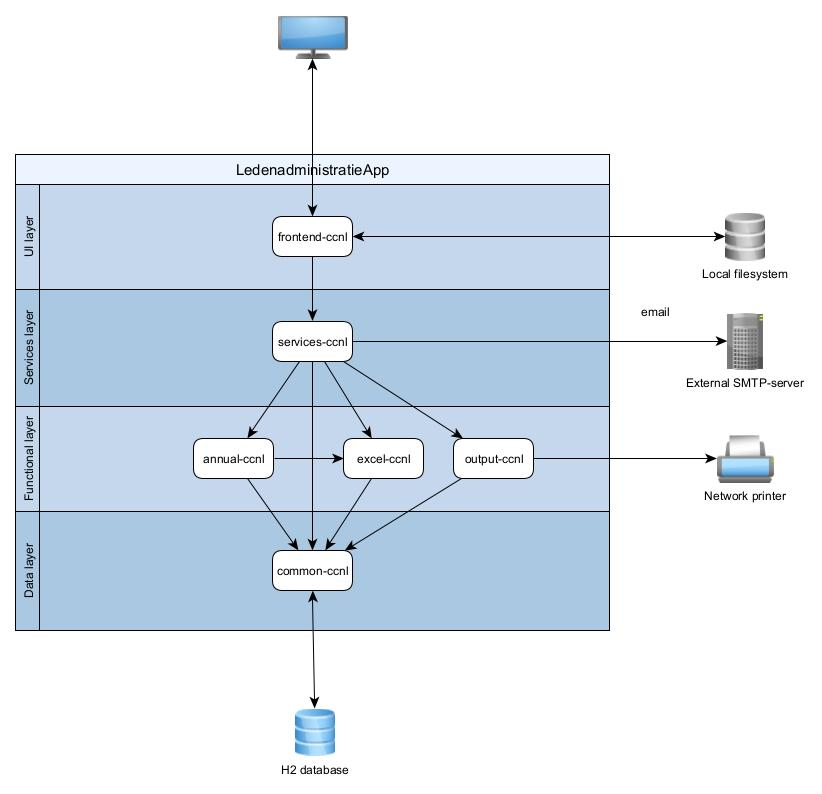

# ledenadministratieCCNL
JAVA-FX application for membership administration of Citroën Club Nederland.

# Purpose of this application.
As a 'regular' Java-developer you normally don't come across Java-FX. 
But now that I'm retired I have time to look at this intriguing technology.
There are a lot of examples on the internet but mostly not beyond the HelloWorld level.
I wanted to explore Java-FX in a full size application, so with dozens of screens and menu choices. It also should interact with a real business layer.

Exploring a technology is easier when there is a well understood use-case. 
For me this membership administration is such a use-case. I already had some java code working on MS-Excel sheets.
The idea was to enhance this starting point to a real desktop application.

Aside of developing the application, I also wanted to look at an efficient deployment of the application, thus looking at JPMS and JPackage.

# Design
### Some non functional Requirements
1. Layered application structure.
2. Quick startup (focus on lazy loading)
3. Easy deployment
4. Using FXML (mainly because I could use JavaFX SceneBuilder)

### Layered application

### Starting with Spring Boot
I've designed quite some applications throughout my career.
Over the years Spring Boot has been the natural starting point for structuring an application. After checking some websites it turned out that combining Spring Boot and Java-FX is quite easy. So I had built the application with Spring Boot as it s backbone; see README_springboot.md. 

However I felt not completely happy with Spring Boot, specially the configuration via `PropertySource`s was not flexible enough. So I started thinking what are the benefits of Spring Boot in the application and can I keep the benefits with another solution?
 
These are the benefits I use:
1. Standardized configuration
2. Simplified JPA support via repository interfaces
3. Bean singletons
4. Powerful eventing support.

### New design
I use project Lombok and I am a fan of the `@UtilityClass` annotation to define static final classes. I have chosen such utility classes to structure the configuration of the application properties (`ApplicationProperties`), excel properties (`CCNLColumnProperties`) and properties from the Settings database table (`DatabaseProperties`).

For JPA I kept the idea of repositories, but now as singleton classes with a superclass containing the more generic database actions. I've added two utility classes, one `EntityManagerProvider` to provide the `EntityManager` and another `TransactionUtil` for transaction support. 
The persistence interaction of the rest of the application didn't change much.

To support unit testing I use `java.util.ServiceLoader` for `EntityManagerProvider` and `DatabaseProperties` to load unit test variants that don't require a real database connection.

The Spring beans were simply replaced by the singleton pattern. The JavaFX controllers are the main singletons. I use lazy instantiation. There are two triggers for instantiation of controllers:
1. The `fx:controller` attribute while loading and fxml-page
2. The singleton is target for an event of the dialog flow.
The controllers use singletons in the service layer, which in there turn use singletons in the business logic modules. These singletons use repository singletons for persistence. Instantiation of these related singletons are all triggered by instantiation of controller singletons. 
Checkstyle gives me a warning that unit testing singletons is not easy, but the only thing I had to change is that the `instance` variable is not `final` so I can load mocks where needed.

The `MenuController` that is linked to the menu bar handles all the menu choices. It delegates the work to the other controllers. If the `MenuController` had hard references to the other controllers, than lazy loading is not possible. So The `MenuController` has to be decoupled of the other controllers. This is done by using eventing.  The `MenuController` just fires events.

The last point to tackle was eventing. 
During the build I can generate a SmallRye `jandex.idx`. At runtime, during the JavaFX `init()`, the `jandex.idx` is analyzed for `Eventlistener` annotations. This yields a map of event targets. It works just as fine as the Spring Boot Eventlistener. The `EventProcessor` uses `Class.forName("<fully qualified class name>")` to lazily load the required class and then instantiate the singleton for it, so it also has no hard references.

The last thing I kept from the old Spring Boot application is the trick to avoid JavaFX demanding for Java modules (JPMS). The trick is that the class that has the main method is *no* subclass of `javafx.application.Application` The main method just launched another class that is an extension of `javafx.application.Application`. 
(I've tried making the application modular, but with so many not well structured non modular jars, it was just not possible.)

### Performance
Starting the redesigned application goes a lot faster than the Spring Boot variant. However I noticed that there was a drawback of the strict lazy instantiation of singletons. The persistence layer only got activated when there was a request coming from the user interface. Since activating the persistence layer takes more than 3 seconds, this delay can't be ignored.
I've improved this by starting a separate thread in the JavaFX `init()` phase which activates the persistence layer. This solves the delay issue. (The user already sees the first screen and in the time it takes the user to make a menu choice, the persistence layer is activated.)

Every FXML is only loaded when needed and only loaded once. Also the same `FXMLLoader` instance is reused; reusing cached classes. There is no notable delay when loading FXML.   

On the internet you can find discussions of a slow performing applications because of wrong usage of `Platform.runLater(<Runnable>)`. So I use `javafx.concurrent.Task`s to perform background task in another thread than the FX thread. 
At the end of a background task, the JPA EntityManager is closed to free resources.

In all of the application actions, the response is instantly.

The memory usage is normally less than 250mb, but doubles making a database backup or restoring the database.

### Deployment
The deployable application consists of:
* Java runtime enviroment which contains only the required JDK modules with the required JavaFX  modules added to it.
* One über jar containing the application code an all the dependency jars. This jar also has a splashscreen configured to inform the user that the application is starting.

The  über jar is generated by the Maven Shade plugin. I ran the JDeps tool against this über jar to determine the required JDK-modules. JDeps signal more modules than actually needed. 
There is still a lot unused code in this über jar because of extra code in the dependencies, so I could remove modules that only relate to this unused code:
* java.compiler
* java.datatransfer
* java.rmi
* java.security.jgss
* java.security.sasl
* java.transaction.xa
* java.xml.crypto
* jdk.jfr
* jdk.net
* jdk.unsupported.desktop

On the other hand JDeps misses the jdk.crypto.ec (cypher suites) that are needed for the (mail) TLS-connection, so I added that one. (This is a known flaw in JDeps.)
  
I use JPackage to generate a MicroSoft Installer; (see app-ccnl/target/installer directory).
Note: I use the `exec-maven-plugin` to run JPackage, because I was unable to get a `jpackage-maven-plugin` working.
 
When you accidently start a second instance of the application, it will start with an error on the database connection. Stopping this second, in error, application is ignored; you will have to use the Windos Taskmanager to stop it. Therefore I added a uniqueness check at start up; (using `java.lang.ProcessHandle` to find the relevant process information). 
When an already running process is detected, the start up is aborted immediately, so before the start of JPA and JavaFX.  

## Maven Build
I'm currently using Maven version 3.9.5. 

In the Maven user settings.xml you need to set the property `jpackage.exe` and point it to the `bin\jpackage.exe` in the Java 21 JDK. 

A Maven package build will build the application and the MicroSoft Installer. 

Jacoco is configured, so you should be able to run `clean verify sonar:sonar` (assuming you have SonarQube setup).
